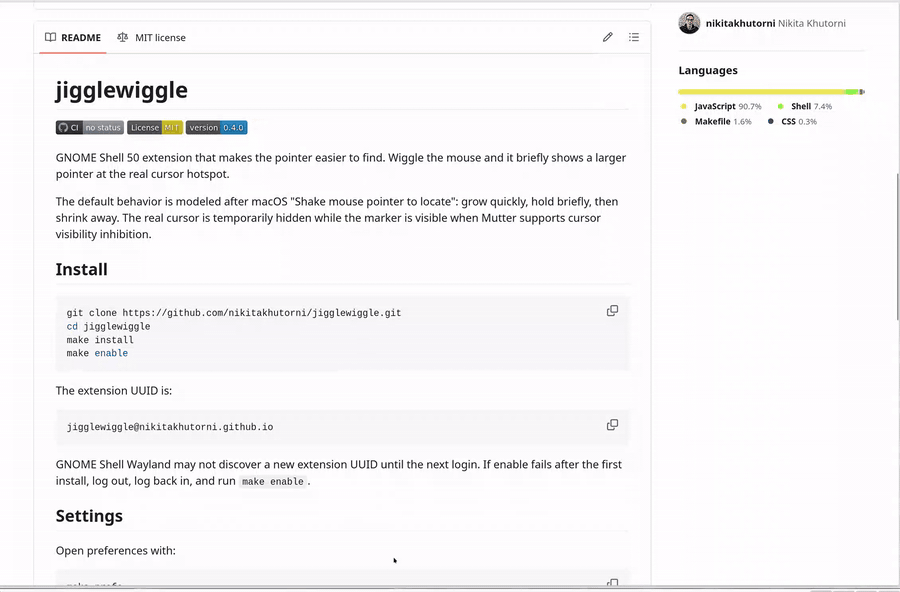

# jigglewiggle

[](https://github.com/nikitakhutorni/jigglewiggle/actions/workflows/ci.yml)
[](LICENSE)
[](CHANGELOG.md)

GNOME Shell 50 extension that makes the pointer easier to find. Wiggle the
mouse and it briefly shows a larger pointer at the real cursor hotspot.



The default behavior is modeled after macOS "Shake mouse pointer to locate":
grow quickly, hold briefly, then shrink away. The real cursor remains active
for hover, text selection, and clicks while the marker animates.

## Install

```bash
git clone https://github.com/nikitakhutorni/jigglewiggle.git
cd jigglewiggle
make install
make enable
```

The extension UUID is:

```text
jigglewiggle@nikitakhutorni.github.io
```

GNOME Shell Wayland may not discover a new extension UUID until the next login.
If enable fails after the first install, log out, log back in, and run
`make enable`.

## Settings

Open preferences with:

```bash
make prefs
```

Available controls:

- Enabled
- Wiggle sensitivity
- Maximum scale
- Growth speed
- Peak hold
- Shrink speed
- Respect reduced motion

## Development

```bash
npm test
make pack
make install-enable
```

Source lives in `extension/`. Generated files are not committed:

- `extension/schemas/gschemas.compiled`
- `dist/*.zip`

Useful commands:

```bash
make logs
make disable
make uninstall
```

## Notes

- Target: GNOME Shell 50, tested locally on 50.2.
- Session target: Wayland.
- Install scope: per-user only.
- The name nods to [Jiggle](https://github.com/jeffchannell/jiggle) and
  [Wiggle](https://github.com/mechtifs/wiggle). Wiggle is a GNOME 45+ port/fix
  fork of Jiggle.
- Clean-room implementation; no copied code or assets from Jiggle or other
  cursor extensions.
- Cursor bitmap extraction is not implemented.
- The enlarged pointer is visual-only; the real cursor remains visible and
  interactive.
- Apple does not publish the exact timing constants for macOS pointer location.
  The defaults are a clean-room approximation; see
  [docs/research/macos-pointer-location.md](docs/research/macos-pointer-location.md).

## License

MIT
